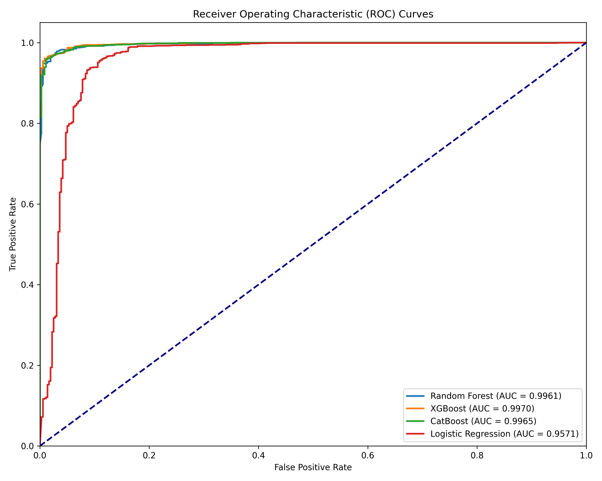
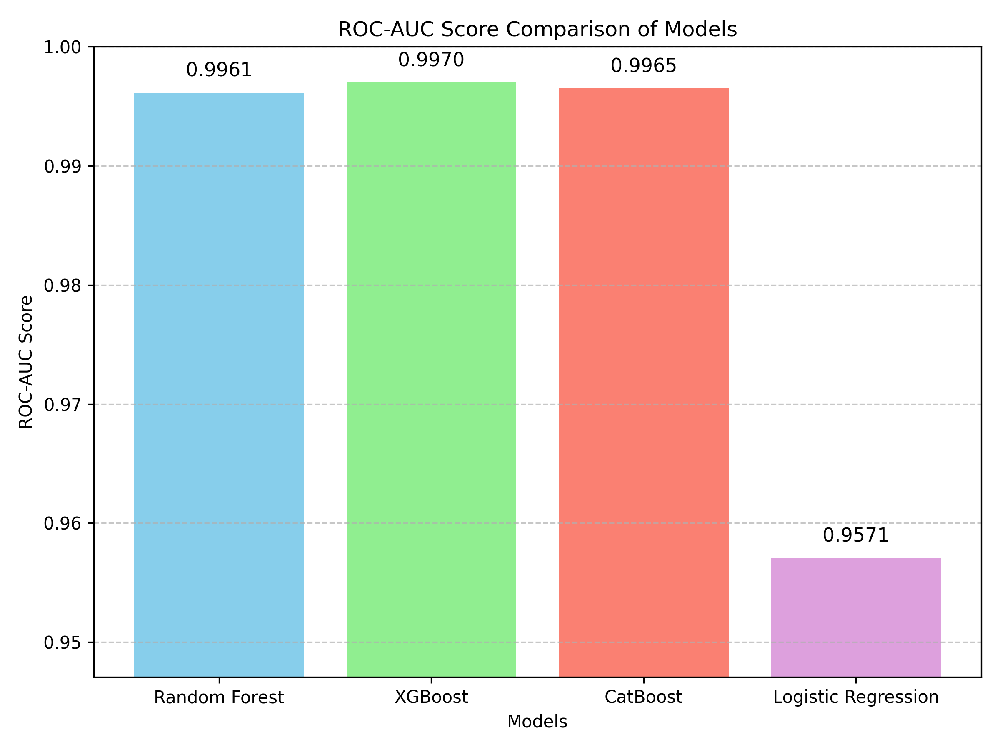
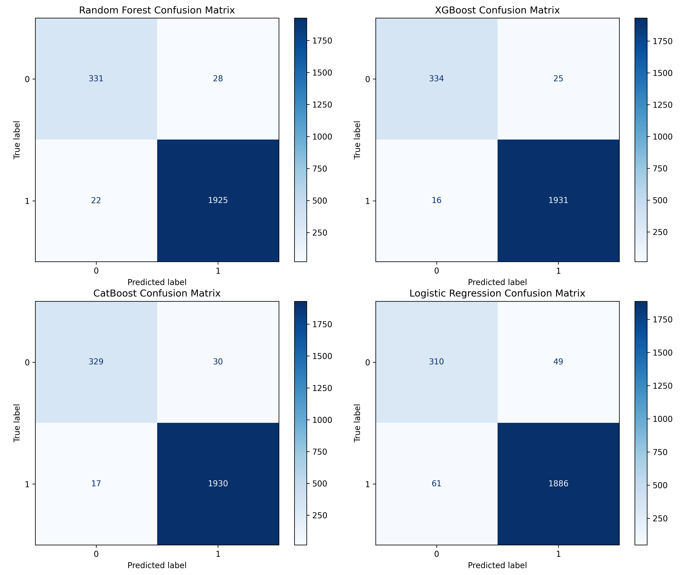
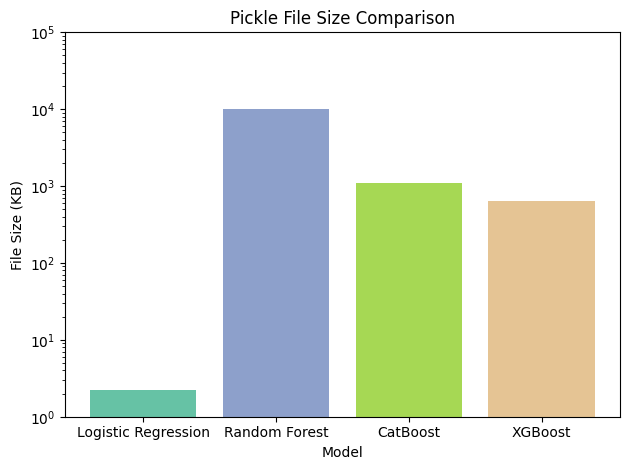
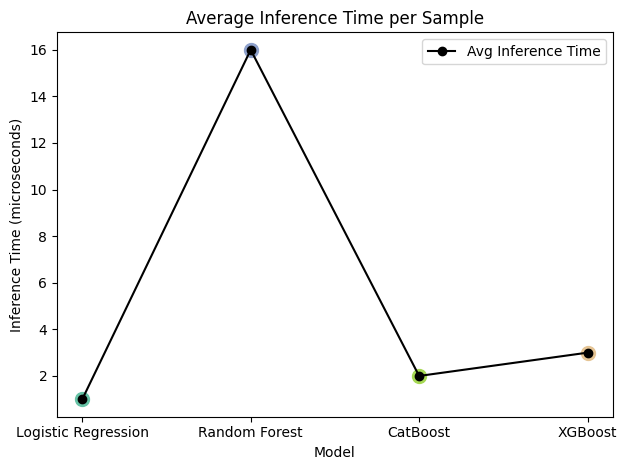
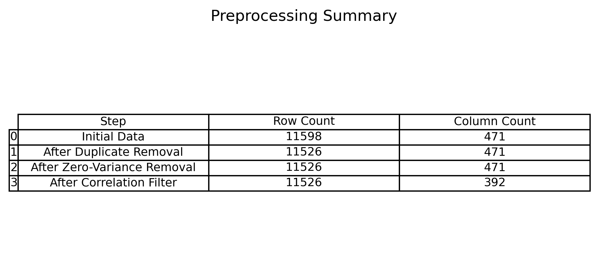
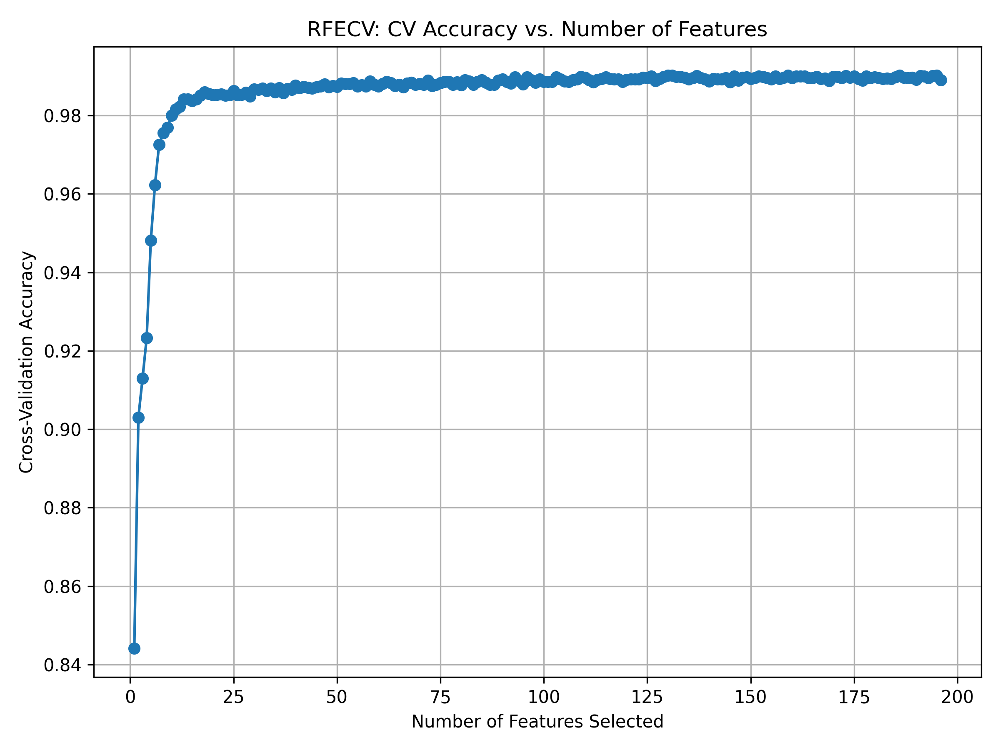

<div align="center">

# 🛡️ Static Android Malware Detection

### Achieving Lightweight & High-Accuracy Malware Detection via Two-Stage Feature Selection

**📄 Published at IEEE**


</div>

---

## 📌 Overview

Android malware is evolving faster than traditional signature-based defenses can keep up. This research tackles that problem with a **static analysis pipeline** — no app execution needed — combined with a **novel two-stage feature selection strategy** that simultaneously achieves:

- ✅ **98.27% accuracy** (XGBoost)
- ✅ **Smallest model footprint** among all trained classifiers
- ✅ **Fastest inference time** suitable for lightweight deployment
- ✅ **Published & peer-reviewed at IEEE**

> The core research question: *Can we build a malware detector that is not just accurate, but also lean enough for real-world deployment?* The answer was **yes** — and XGBoost proved it.

---

## 🔑 Key Contribution — Two-Stage Feature Selection

Most malware detection research focuses purely on accuracy. This work goes further by engineering a **two-stage feature selection pipeline** designed to reduce model complexity without sacrificing performance:

```
Stage 1 — Tree-Based Importance (SelectFromModel)
    └── Random Forest trained on SMOTE-balanced data
    └── Features below median importance threshold → eliminated

Stage 2 — RFECV Refinement (Recursive Feature Elimination with Cross-Validation)
    └── Stratified K-Fold CV to find optimal feature count
    └── Removes redundant features Stage 1 missed

Result → Minimal, highly discriminative feature set
       → Smaller model size + faster inference + no accuracy loss
```

This two-stage approach is what enabled XGBoost to become both the **most accurate** and **most lightweight** model in the comparison — the central finding of this research.

---

## 📊 Results

### Accuracy after Threshold Tuning

| Model | Accuracy | Model Size | Inference Speed |
|---|---|---|---|
| **XGBoost** ⭐ | **98.27%** | **Lightest** | **Fastest** |
| CatBoost | 98.05% | Heavy | Moderate |
| Random Forest | 97.92% | Large | Moderate |
| Logistic Regression | 96.31% | Small | Fast |

> XGBoost trained on the two-stage selected features delivered the best accuracy **and** the smallest serialized model size — validating the core hypothesis of this research.

### ROC Curves

<div align="center">

<br/><sub>ROC Curves — All Models</sub>
</div>

<div align="center">

<br/><sub>ROC-AUC Score Comparison</sub>
</div>

### Confusion Matrices

<div align="center">

</div>

### Model Efficiency — The Lightweight Proof

<div align="center">

<br/><sub>Serialized Model Size — XGBoost is the smallest</sub>
</div>

<div align="center">

<br/><sub>In-Memory Footprint Comparison</sub>
</div>

<div align="center">

<br/><sub>Inference Time — XGBoost leads in speed</sub>
</div>

---

## ⚙️ Pipeline

```
Android APK Dataset
        │
        ▼
Static Feature Extraction
(Syscall + Binder frequency vectors — no execution required)
        │
        ▼
Data Cleaning & Preprocessing
(Deduplication · Null filling · StandardScaler)
        │
        ▼
SMOTE — Synthetic Minority Oversampling
(Balance malware vs benign class distribution)
        │
        ▼
TWO-STAGE FEATURE SELECTION  ← Core Contribution
 ├── Stage 1: Tree-Based SelectFromModel
 └── Stage 2: RFECV with StratifiedKFold
        │
        ▼
Model Training + GridSearchCV Tuning
 ├── XGBoost       ← Best: accuracy + lightest
 ├── CatBoost
 ├── Random Forest
 └── Logistic Regression
        │
        ▼
Evaluation
(Accuracy · ROC-AUC · Confusion Matrix · Model Size · Inference Time)
```

<div align="center">

<br/><sub>Preprocessing Summary</sub>
</div>

<div align="center">

<br/><sub>RFECV — Optimal Feature Count</sub>
</div>

---

## 📂 Repository Structure

```
Static_AMD_ML/
└── Static_Android_Malware_Detection_ML/
    ├── Final_Malware_Code.ipynb
    ├── Trial_1.ipynb
    ├── Trial_2.ipynb
    ├── data_cleaning_&_Trial.ipynb
    ├── dataset/
    │   ├── clean_dataset_malware2.csv
    │   └── vectors_syscallsbinders_frequency_5_Cat.csv
    ├── Trained_Models/
    │   ├── best_final_xgb_model.pkl
    │   ├── rf_model.pkl
    │   ├── cat_model.pkl
    │   └── logreg_model.pkl
    ├── images/
    │   └── (all result plots)
    └── catboost_info/
```

---

## 🧰 Tech Stack

| Category | Tools |
|---|---|
| Language | Python 3 |
| ML | Scikit-learn, XGBoost, CatBoost |
| Data | Pandas, NumPy |
| Imbalance | imbalanced-learn (SMOTE) |
| Visualization | Matplotlib, Seaborn |
| Profiling | Pympler, psutil |
| Environment | Jupyter Notebook |

---

## 🚀 Getting Started

```bash
git clone https://github.com/Inderpreet26/Static_AMD_ML.git
cd Static_AMD_ML/Static_Android_Malware_Detection_ML

pip install numpy pandas matplotlib seaborn scikit-learn xgboost catboost imbalanced-learn pympler psutil

jupyter notebook Final_Malware_Code.ipynb
```

---

## 📄 Publication

This research has been **peer-reviewed and published at IEEE**. If you use this work, please cite accordingly.

https://ieeexplore.ieee.org/abstract/document/11136486

---

<div align="center">

**Inderpreet Singh Makkar** — B.Tech Final Year Research Project

*IEEE Published · Two-Stage Feature Selection · Lightest + Best Performing Android Malware Detector*

</div>
